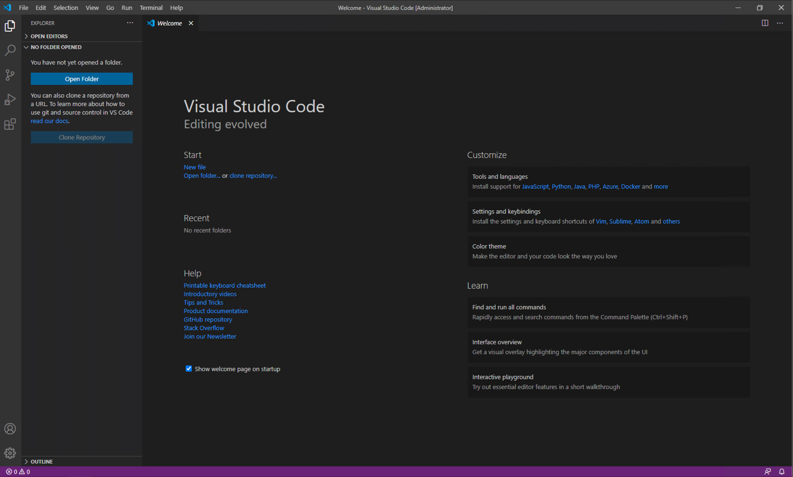
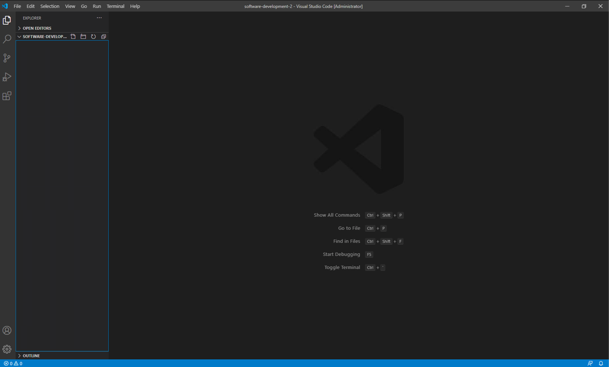

# Software Development 2 Lab 01 -- Getting Started with Web Development

## Setting Up a Development Environment

 > In this module, we are going to use Visual Studio Code to edit our code files. Visual Studio Code is an enhanced text editor that supports extensions. As web pages are just text files this makes Visual Studio Code an ideal tool to use.

  Visual Studio Code can be downloaded from https://code.visualstudio.com/.

 1. **Download Visual Studio Code for your operating system.**
 2. **Install Visual Studio Code**.
 3. **Once installed, start Visual Studio Code**.

 Once started, you will be presented with the following window:

 


 ### Visual Studio Code Extensions

 On the left hand side of the Visual Studio Code window, you will see five buttons. These are:

 * **Explorer** where you can view the files in your project.
 * **Search** which lets you find items in your project.
 * **Source Control** which is about managing versions of your software. We will explore this in more detail next week.
 * **Run** which allows us to run our code if that is suitable.
 * **Extensions** which allows us to manage installed extensions in Visual Studio Code.

 **Click the Extensions button and the screen will change to the following:**

 

 #### To install an extension:

 1. Search for it in the search bar at the top of the extensions panel.
 2. Click the install button.


 **Add the following extensions to Visual Studio Code:**

  **Auto Close Tag.** This extension makes life a little easier for HTML.*


### CLASS LAB: Creating Your First Project

**Click on the Explorer button on the left-hand side of the Visual Studio Code window. The window will change to the following:**


**Click the Open Folder button. Go to the folder that you plan to work from in this module.** Your screen should now be as follows:



**Right-click the explorer pane (outlined in blue in the image above) and select New File to create a new file.** You are now ready to continue on with the rest of the lab.

## Document Structure

We interact with numerous documents in our day-to-day life -- from web articles, to books, newspaper articles, and flyers. One common aspect of documents are they have a structure. For example, a book has:

- A title.
- Chapter headings.
- Text.
- Possibly images.

Structure helps us understand how to read a document. A web page is no different.

Different kinds of documents have structure in common - for example, news articles and an FAQ follow the same guidelines.

As an example of a simple structured document, you can create a Word document using the different styles such as headers. For example:
<hr>

 # This is the Main Heading

 This is some introduction text. We normally introduce our text.

 ## This is a Sub-Heading

 We use sub-headings to break up large documents.

 ## This is Another Sub-Heading

 Some more text.
<hr>

#### But what about web pages?

HTML -- HyperText Markup Language -- is a fully text-based method for creating a structured document. An HTML file is just a text document, but we set the structure by using instructions called HTML elements.  The browser reads the document, and knows when it encounters an instruction rather than content, by the opening and closing tags.

## Introduction to HTML and Web Pages

Let us look at the most basic web page using our content for a Word document above.

```html
<!DOCTYPE html>
<html>
  <head>
    <title>My First Web Page!</title>
  </head>
  <body>
    <h1>
      This is the Main Heading
    </h1>
    <p>
      This is some introduction text. We normally introduce our text.
    </p>
    <h2>
      This is a Sub-Heading
    </h2>
    <p>
      We use sub-headings to break up large documents.
    </p>
    <h2>
      This is Another Sub-Heading
    </h2>
    <p>
      Some more text.
    </p>
  </body>
</html>
```

 **STOP**. Take your time now and look at the HTML code above and compare it to the document presented previously. Can you see the structure of the document.

You can find the web page generated from this code [here](first.html).

 **EXERCISE** Enter the code example above into your editor and save the file as `first.html`. Then open this file in your web browser to see the result.

<hr>

 **NOTE**: You will need to open the file directly in your web browser, which is different from how you usually access a web page which is via its 'url'.  To open a file try going to your browser and pressing crtl o .  You should see something in your address bar like this: file:///home/lisah/lessons/github/module-content/msc-software-development-2/week-01/seminar/Slide6.jpg.  ie, file:/// then the full path to your file.  Use the refresh button to show new changes you save to your html file.
<hr>


HTML files use *tags* to specify elements. A tag defines an *element* in our web page. For example, `<p>` is used for a paragraph or text element.

Most elements are defined using an opening tag, e.g., `<p>`, and a closing tab, e.g., `</p>`. Everything within the opening and closing tag is part of the defined element.

HTML tags can also have *attributes*. For example, try changing one of the opening `<p>` tags to the following:

`<p style="color:red">`

A tag's attribute is set using its *name* (here we set `color`) and use `=` and a value in quotes. We will come across various tags as we continue to develop our skills, and also learn more about how colours are represented in HTML.

Let us look at the different parts of the HTML document. Note that the following tags are 'nested' ie. tags are often enclosed by other tags, working from the outer to inner parts of the document, indeed this is what gives the document structure.

Missing or mis-placed closing tags are a common source of errors in HTML documents.  Accuracy is key!

- `<!DOCTYPE html>` starts an HTML file. **THIS IS REQUIRED**. Your browser uses this tag to know what type of document it is receiving.
- `<html> ... </html>` denotes the main HTML document contents.
- `<head> ... </head>` defines the header of the HTML document. Most header information is not displayed on the web page. It is used to provide additional information about the web page.
- `<title> ... </title>` is the title of the web page as it appears in the browser tab. The title is not displayed in the web page itself. It is just used as the page title in the browser tab.
- `<body> ... </body>` is the main body of the HTML page. This is the contents rendered by the browser and displayed to the user.
- `<h1> ... </h1>` is a top-level (level 1) header.
- `<h2> ... </h2>` is a level 2 header (sub-heading).
- `<p> ... </p>` defines a paragraph

<hr>

NOTE: Do you know the difference between **semantics** and **syntax**?  Semantics is concerned wtih meaning ie. how the HTML elements have a logical relationship and reflect the correct purpose.  Syntax is the correctness of how you write your html for example, do you have the quote marks correct?  Syntax must be correct for a page to load properly, semantics is of increasing importance for example, in HTML5 and SEO as well as in javascript.  The Document Object Model (**DOM**) is the term for the tree-like structure of HTML documents that enables elements to be accessed and manipulated.

<hr>

### Now you try

Try and create the following web pages using HTML and view them in your browser. You will probably need to use the resources referenced.

First page.

> # Welcome to Software Development 2
>
> This is a module delivered at [The University of Roehampton](https://www.roehampton.ac.uk).  HINT: This is a link: you will need the 'a' tag [Reference](https://www.w3schools.com/tags/tag_a.asp) .
>
> We can also define list items.  This is an unordered list, meaning that it is not numbered.  HINT: you will need the ul, and li tags  [Reference](https://www.w3schools.com/tags/tag_ul.asp) .
>
> - List item 1.
> - List item 2.
> - List item 3.
> - List item 4.
>
> And tables: HINT: you will need the table, tr (table row), th (table heading) and td (table data) tags ([Reference](https://www.w3schools.com/tags/tag_ul.asp) .) .
>
> | Column Header 1 | Column Header 2 | Column Header 3 |
> | --------------- | --------------- | --------------- |
> | Some data       | Some data       | Some data       |
> | Some data       | Some data       | Some data       |

Second page.

> # My Personal Web Page
>
> Images are easy. You can get the Wikipedia Logo [here](https://upload.wikimedia.org/wikipedia/en/thumb/8/80/Wikipedia-logo-v2.svg/1200px-Wikipedia-logo-v2.svg.png)  HINT:  img tag [Reference](https://www.w3schools.com/tags/tag_img.asp)
>
> 

Try adding more images to your web page.
<hr>

 **NOTE**: Make sure you have a very good understanding of 'absolute' and 'relative' paths for images (and other files.)  A common form of errors and other headaches are incorrectly referenced links.  If you are not already familiar with absolute and relative paths, study this page: https://www.w3schools.com/html/html_filepaths.asp.  You should almost always use relative paths as this makes your web pages portable across different servers and domains.
<hr>

### Developer tools

Using the browser developer tools (found in all browsers, but chrome is most commonly used) to debug and refine your front-end code is an essential skill.

__Try it now:__

In your browser window, right click in the page and choose 'inspect'.  A set of windows will appear, probably at the bottom or perhaps to the right of your screen.  Here you will be able to examine the source code of your own page and ensure that it is as you expect. You can even find you can edit the markup, content and styles.

Note that you can do this for any web page!!.  Your changes will only be visible on your own browser and will disappear after you refresh the page.


Reference:
https://developer.chrome.com/docs/devtools/overview/


### Extension task

Find out about the HTML standard and the additional tags that have been introduced. Answer the following questions:

1. Why were these new tags introduced?
2. Is HTML5 a semantic or syntactic innovation?
3. What is microdata and how is this used by search engines?

### So you want to know more

HTML is quite a simple concept once you understand the idea of tagging sections of a text file to present it in a particular manner in the browser, but there is good and bad markup, and a knowledge of web standards such as HTML5 is essential for a web professional.


There are many HTML references online. We recommend [Mozilla's](https://developer.mozilla.org/en-US/docs/Web/HTML/Reference) as a good one.

