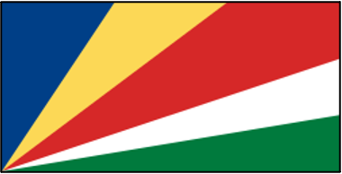
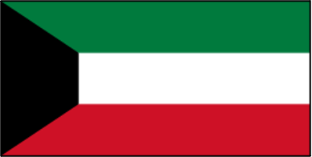
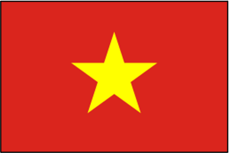
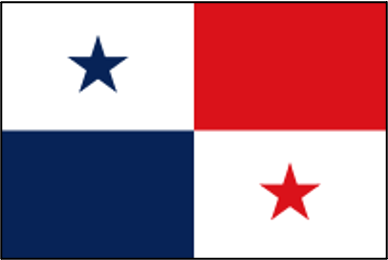
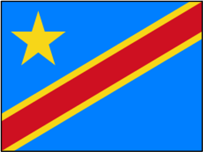

# Software Development 1 
# Lab 1 -- Programming Flags

Aim: Learn how to draw flags of the world by using just Python code.

To complete this task, we will use **Anaconda** as a platform, in which **Jupytor notebook** is used an interative editing and running application.
If you are working on a university lab machine, Anaconda has already be installed. For your personal machine, please refer to [Anaconda installation guidance](https://github.com/roehampton/module-content/blob/2952fe07acf1408430e1b86a5f3efeb63d77a584/software-development-1/week-01/lab/Anaconda_installation.md).

test

After Anaconda is successfully installed, you can start following the step-by-step instructions below to draw flags!
## Advice before Starting

The **computer is stupid**. It needs to know exactly what you mean when you give it instructions. It has no ability to guess. To become a programmer, you have to work on three skills as a beginner:

- **Precision** -- you need to **type instructions exactly as given**. The computer is case sensitive, it will treat uppercase and lowercase letters differently. The computer cannot guess your spelling mistakes. You need to be precise when entering instructions.
- **Patience** -- you need to be patient when learning to program. You will make mistakes, and the computer will shout at you. Your job is to recognise your errors and start building your programming capability.
- **Practice** -- you have to **constantly practice**. You cannot write a few lines of code and think you are a programmer. You have to build up a certain type of problem solving skill to talk to the computer and write high-quality software.

## Setting Up Python
1. Open **Anaconda Navigator** from your Start Menu (Windows), Launchpad (MacOS), or equivalent on Linux. Once started, you will be presented with the following window.

 

2. Create a **Jupyter notebook** file with Python 3 kernal (ipykernel). 


 
3. Install graphic library through pip
> In this drawing flag task, we will use **graphics.py** library, which is a simple object oriented graphics library designed to make it very easy for novice programmers to experiment with computer graphics in an object oriented fashion. To install graphics.py library, we use package manager **pip**. 


```
!pip install graphics.py
```

4. After the library is installed, we have to do is **ask Python to import our graphics library**, which allows using the various objects (variables, classes, methods...) from graphics.py without prefixing them with the module's name.
 ```
 from graphics import *
 ```
## Creating a Graphics Window in Python 

In graphics.py, the graphics are drawn in a window. Let us perform the following steps:

- Open a graphics window.
- Set its background to white.
- Close the graphics window

> This is accomplished with the following lines of code. Enter them *precisely* into Python.

5. **GraphWin()** can construct a new graphics window for drawing on the screen. The parameters are optional; the default title is “Graphics Window,” and the default size is 200 x 200 pixels.

```
win = GraphWin()
```

6. We can set colour of the background by **setBackground()**.

```
win.setBackground('white')
```

8. We can close the window by **win.close()**

```
win.close()
```

## Graphics Coordinate Systems

Windows have coordinates. `(0, 0)` is the top-left corner. `(w, h)` is the bottom-right corner -- where `w` is the window width and `h` the height.


## Drawing Rectangles

A rectangle has a start point and an end point. We can also set its colour. Let us do the following:

- Create a graphics window called `name` with a size of 600 by 400.
- Create a rectangle from point (0, 0) to point (100, 200).
- Set the rectangle colour to blue.
- Draw the rectangle.

9. Create a window with given name, width and height.
> As mentioned in step 5, **GraphWin()** can have optional parameters, **GraphWin(title, width, height)**

```
win = GraphWin('name', 600, 400)
```

10. Create a rectangle.
> Windows have coordinates. (0, 0) is the top-left corner. (*w*, *h*) is the bottom-right corner, where *w* is the window width and *h* the height.
> A Rectangle has a start point and end point.

```
rect = Rectangle(Point(0, 0), Point(100, 200))
```

11. Set the colour fill to the rectangle.

```
rect.setFill('blue')
```

12. Draw the rectangle (**rect**) to the window (**win**)

```
rect.draw(win)
```

13. Close the current window

```
win.close()
```
### Now You Try -- Completing the French Flag
So far we have learnt how to create rectangle with specific colour. Think about the French flag (as below). How can we  draw it by python?


If you cannot complete this, the following instructions will help you complete the flag.

14. Let's create a window in flag size named "France"

```
france = GraphWin('France', 600, 400)
```

The French flag consists of three rectangles with colour blue, white and red.

15. Draw the blue bar on the window.

```
rect = Rectangle(Point(0, 0), Point(200, 400))
rect.setFill('blue')
rect.draw(france)
```

16. Draw the white and red bars on the window.

```
rect = Rectangle(Point(200,0), Point(400, 400)))
rect.setFill('white')
rect.draw(france)
```
> Try the red bar by yourself. Also, remember to close the window when you are finished.

### Try more -- More Rectangle-based Flags

17. Now it's time to try some rectangle-based flags by yourself.

Write code to draw the following flags.

- **Indonesia**


- **Poland**


- **Austria**


- **Gabon**


- **Yemen**


- **Mauritius**


- **Italy**


- **Mali**


- **UAE**


## Drawing Circles

18. For some circle-based flags (e.g., Japanese flag as below), we use **Circle()** to draw circles. Circles are defined by a centre point and a radius.

```
circle = Circle(Point(100, 100), 50)
```

Similar to rectangle, we can set the colour fill to the circle, and then draw it on the window.

```
circle.setFill(‘red’)
circle.draw(win)
```
### Now You Try -- More Circle-based Flags

- **Laos**


- **Maldives**


## Drawing Lines

19. For some line-based flags (e.g., Scottish flag as below), we use **Line()**. Each line is defined by two points, and we can set the colour (outline) and width of the line. Of course, it can also be drawn on the window.


```
line = Line(Point(0,0), Point(600, 400))
line.setOutline('red')
line.setWidth(80)
line.draw(win)
```
### Now You Try -- More Flags with Lines

- **Gambia**


- **Thailand**


- **England**


- **Sweden**


- **Tonga**


- **Botswana**


- **Norway**


- **Trinidad and Tobago**


- **United Kingdom**


- **Greece**


- **Morocco**


## Drawing Polygons

20. Finally, let's look at some more complicated flags baseed on polygons (e.g., Bahamas as below).

- **Bahamas**

 

We use **Polygon()** to draw polygons, where the polygon corners are defined by parameters. For example, to draw a triangle, we can draw a polygon with three points.

```
tri = Polygon(Point(0,0), Point(200,200), Point(0,400))
```

Also, the colour can be set by **setFill()**.

```
tri.setFill('black')
tri.draw(win)
```
### Now You Try -- More Polygon-based Flags

- **Jamaica**

.

- **Seychelles**

.

- **Kuwait**

.

Now I believe you have got enough confidence to draw more challenging flags. Here some advanced flags are prepared for you to play with.

- **Vietnam**

.

- **Panama**

.

- **Democratic Republic of Congo**

.

Good luck and have fun!
