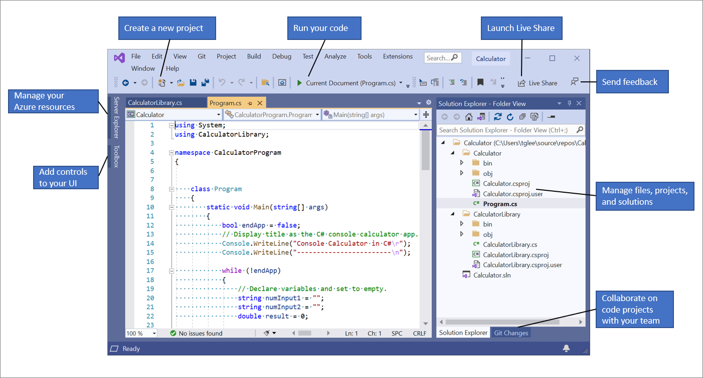
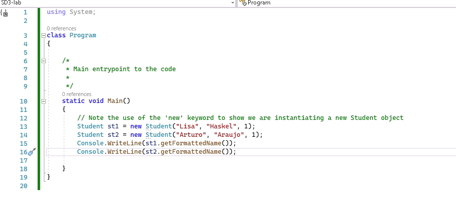

# Software Development 3
# Lab 1

## Intro to C# and OOP


### Visual studio

NB: these instructions are for Visual Studio NOT Visual Studio Code.

Install Visual Studio if you are using your own computer. It is available for Windows of Mac. If you are using Linux, its fine.. just ask.

Add the following options when you  install:

  * add f# language support
   * windows app SDK C# templates


Launch Visual Studio from the start menu of your computer.


The Visual Studio integrated development environment is a creative launching pad that you
can use to edit, debug, and build code, and then publish an app. Its very easy to get started with c# in Visual Studio.


The screenshot below will introduce you to its main features.




### Getting started

To start, we need to create a C# application project. The project type comes with all the
template files you'll need before you've even added anything!
1. Open Visual Studio
2. On the start window, choose Create a new project
3. In the Create a new project window, choose Console App with c# and click next
4. In the Configure your new project window, type or enter SD3-lab in the Projectname box. Click 'place solution and project in same directory box'. Then, choose Next.
5. Framework .Net 6 should be already selected.  choose Create.

Visual studio will now build your project and open a VS window with the 'Program.cs' file open.

6. Run the programe using the green arrow at the top of the screen.  A black console window will open and output 'hello world'.  
7. You will need to press any key to terminate the programme and close the console window.


### Getting to know C# Fundamentals

Here are some fundamental features of any programming language.  Use the following exercises to familiarise yourself with how you should use these in c#.

   * Types and variable declarations
   * Basic syntax: expressions and code blocks
   * Variable scope
   * Function definitions
   * Comments
   * Conditional statements
   * Loops (iteration)
   * Modules and namespaces
   * Classes and objects <----- The main part of this module!


Familiarise yourself with the language fundamentals above by completing the following tasks:

1. In the code editor, delete the default "Hello World" code in the Program.cs file and replace it by the
following code.  _This code template is a standard way to provide an entrypoint to a c# console application though shortened syntaxes do exist, its good to get familiar with this._

The code block with the function signature 'static void Main()' will always be called as the entrypoint to your code. Normally, this will be in a file called Program.cs.

```c#
using System;

class Program
{

    // Performs a calculation
    static void Main()
    {
        int a = 42;
        int b = 119;
        int c = a + b;
        Console.WriteLine(c);
    }
}

```

Run the code without debugging with the pale green arrow or pressing ctrl F5.

Now you know how to print information back to the user.

2. Change the variable declaration of b to the following

```c#
string b = "119";

```

Try and run the code. What happens? Why? How can you tell what the error is? What possible solutions are there? (hint - there is more than one solution - it depends what result you want).

3. Now initialise variable b as an array of ints and loop through it.

Hints:
Declare an array as variable b as follows: 

```c#
        int[] b = { 1, 4, 6, 7 };
```

Loop through b using a foreach loop reference: https://www.w3schools.com/cs/cs_foreach_loop.php

4. Add some code to the above exercise such that there is only output if the number is 6.  Comment your code with at least one single line and at least one multiline comment.


### Create your first class and objects

You will create the student class as represented by this class diagram. You will create two student objects in your 'main' function in Program.cs and output correct information about them.


1. Create a new file called Student.cs. It should be in the same directory as your Program.cs file.  _(HINT: you can right click on your project in the solution explorer, got to 'add', 'new item' and then c# code file or class. You will then need to rename the file, again with a right click.).  It is conventional that you have just one class per file, and that the file name is the same as your class name.
2. Add the following code to Student.cs (you will not be able to cut and paste!!)


3. To create objects of class Student, go back to Program.cs and write the following:



4. This code should run but its not giving you useful results. Go back into Student.cs and amend the getFormattedName() method so that the name and course of each student is printed correctly.

Hint: you can use 'string interpolation' to embed variables into strings for example:

```c#
string teacher = "LisaH";
string hello = $"Hello {teacher} !";
Console.WriteLine(hello);
```

The outupt of this snippet would be

```
Hello LisaH !
```


#### Do you want to do more?

1. Create a course class with some suitable properties and a print method.  Use this in the student class instead of the simple courseId.  Consider how you might create courses and add them to students in the Main() function.
2. Implement the remaining methods of the Dog class used in the slides and improve the logic of the bark() function.