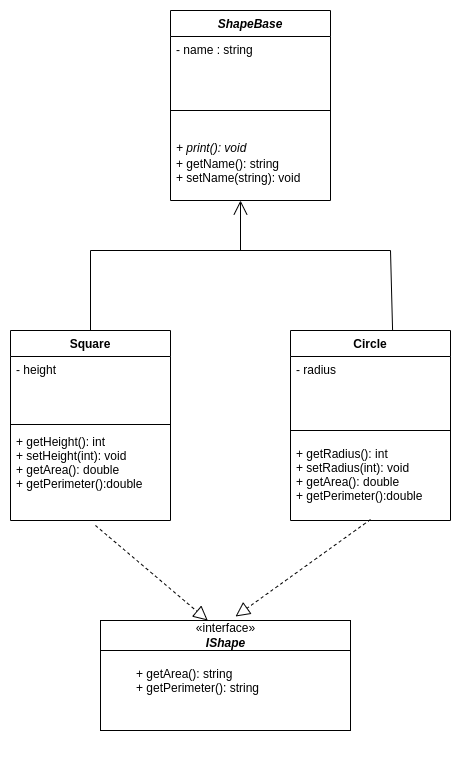

# Lab 3 examples and solutions

## Shapes


## ShapeBase.cs


```c#
abstract class ShapeBase
{

    public string name;

    public ShapeBase(string name)
    {
        this.name = name;
    }

    public string getName()
    {
        return this.name;
    }

    //  If this method has the 'virtual' keyword then the derived class method will always run (this is the better solution)
    //  If there is no virtual keyword, then the base class method will run in some circumstances for example if the shape is created as the Base class type
    public void print() {
        Console.WriteLine("Printing the base class print method");

    }

}
```

## Square.cs

```c#
class Square : ShapeBase, IShape
{
    private int height = 200;

    public Square(string name) : base(name) { }

    public double getArea()
    {
        return this.height * this.height;
    }

    public double getPerimeter()
    {
        return 4 * this.height;
    }
    public void setHeight(int h)
    {
        this.height = h;
    }
    
      // If the base class method is declared virtual, we can use the override keyword and get a more predictable result

    public void print() {
      Console.WriteLine("Printing the Square print method");
    }

}
```

## Circle.cs

```c#
class Circle : ShapeBase, IShape
{

    // c# specific style getters and setters
    public int radius { get; set; } = 50;

    public Circle(string name) : base(name) { }

    public double getArea()
    {

        // Area of a circle πr-squared 
        return Math.PI * (this.radius * this.radius);
    }

    public double getPerimeter()
    {

        // Circumference of a circle 2πr
        return 2 * Math.PI * this.radius;

    }

    // If the base class method is declared virtual, we can use the override keyword and get a more predictable result
    public void print()
    {
        Console.WriteLine("Printing the Circle print method");
    }

}
```

## Program.cs

```c#
using System;

class Program
{

    static void Main()
    {

        // Even if ShapeBase is abstract, you can still create a shape as the base class type
        ShapeBase s1 = new Square("square s1");
        // The print method of the base class is called, even though its a square, 
        // unless the base class method has been marked abstract or virtual
        // And the derived class marked as overriden
        s1.print();

        // Specific shapes can also be declared as the type.
        Circle c1 = new Circle("circle c1");

        // As this was created a circle, the circle print method will be called.
        c1.print();
        
    }
}
```

